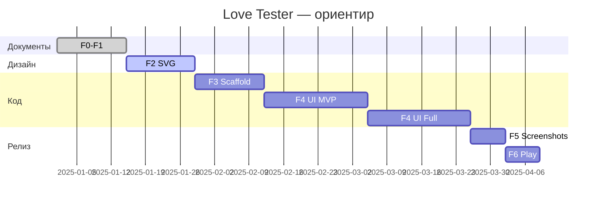

# Объёмный план разработки — Love Tester

**Продукт (RU):** Тест на совместимость и любовь  
**Продукт (EN):** Love Tester  
**Пакет:** `dev.lovetest.app`  
**Стек:** Kotlin · Jetpack Compose · Material 3 · minSdk 26 · targetSdk 35  
**Метод:** LockDraw (`../NEWlockscreen`) — документы → SVG → scaffold → UI 1:1  

**Экраны:** см. [SCREENS_MASTER_PLAN.md](./SCREENS_MASTER_PLAN.md) (**№1–№30**).

---

## 1. Цели и границы проекта

### 1.1 Цель

Выпустить **новое** Android-приложение с тем же **продуктовым охватом**, что у референса Unity 3.0.5 (`com.LoveMaker.TrueLoveTest`), но:

- без Unity (меньший размер APK, быстрее итерации UI);
- с честным disclaimer «только развлечение»;
- с локальным расчётом совместимости (без обязательного сервера);
- с Material 3 и романтической палитрой (`#C2185B` / `#E91E63`).

### 1.2 Что не делаем

- Не «чиним» декомпилированный Java/Unity.
- Не копируем тексты, графику и trademark оригинала.
- Не обещаем «научную» или «истинную» совместимость.

### 1.3 Критерии успеха релиза 1.0

| Критерий | Измеримость |
|----------|-------------|
| Все экраны **№1–№11, №24–№27** реализованы 1:1 по SVG | Design QA |
| Хаб **№6** ведёт минимум на love test; остальные тесты — по решению (см. §4) | Product |
| `verifyLoveTest` зелёный в CI | Gradle |
| RU + EN строки, Privacy URL | `verifyUiInventory` |
| AAB в Internal testing | Play Console |
| Data safety заполнена | Console |

---

## 2. Обзор фаз и сроки (оценка)

Оценка для **одного разработчика + Cursor** (календарные недели ориентировочно).

| Фаза | Название | Длительность | Выход |
|------|----------|--------------|-------|
| **F0** | Продукт и документы | 1 нед | PRD, стек, legal, этот план | ✅ |
| **F1** | Инвентарь экранов | 1 нед | №1–№29, CSV, nav | ✅ |
| **F2** | Дизайн SVG | 2–3 нед | 29 SVG + DESIGN_SYSTEM |
| **F3** | Android scaffold | 1–2 нед | NavHost, тема, verifyLoveTest |
| **F4** | UI + логика | 4–6 нед | 29 Composable, ViewModels, алгоритм |
| **F5** | Store assets | 1 нед | 58 PNG, capture scripts |
| **F6** | Аудит и релиз | 1 нед | Play Internal → Production |

**Итого до первого Store:** ~11–14 недель.



---

## 3. Фаза F0 — Продукт ✅

**Статус:** выполнено.

| Артефакт | Путь |
|----------|------|
| PRD | `PRD.md` |
| Стек | `STACK.md` |
| Релиз-инженерия | `RELEASE_ENGINEERING.md` |
| Legal / онбординг | `ONBOARDING_AND_LEGAL.md` |
| Play checklist | `GOOGLE_PLAY_RELEASE_CHECKLIST.md` |
| Playbook Cursor | `CURSOR_LOVE_TEST_PLAYBOOK.md` |
| Референс | `REFERENCE_SOURCES.md` |

---

## 4. Фаза F1 — План экранов ✅

**Статус:** выполнено.

| Артефакт | Путь |
|----------|------|
| **Пронумерованный план экранов** | `SCREENS_MASTER_PLAN.md` (**№1–№30**) |
| CSV | `screens_catalog.csv` |
| Навигация | `SCREEN_INVENTORY_AND_NAVIGATION.md`, `nav_matrix.csv` |
| Verify | `scripts/verify_ui_inventory.py` |

### 4.1 Два уровня релиза по экранам

| Релиз | Экраны № | Описание |
|-------|----------|----------|
| **MVP 1.0 (узкий)** | 1–11, 24–27, 26 | Splash, онбординг, love test, settings, premium, share |
| **Релиз 1.1 (полный)** | +12–23 | Все тесты из Store-листа на хабе |
| **Релиз 1.2** | +5, 7, 28, 29 | Ads + UMP + interstitial |
| **Релиз 1.x** | +30 | Протокольный тест после референса |

---

## 5. Фаза F2 — Дизайн (Material 3, SVG)

### 5.1 Задачи

| # | Задача | Результат |
|---|--------|-----------|
| 2.1 | Токены типографики, цветов, отступов | `docs/design/DESIGN_SYSTEM.md` |
| 2.2 | Эталон хаба | `screen6_love_test_hub_main_m3.svg` (1080×2400) |
| 2.3 | Пакет 1: №1–7 | System + hub |
| 2.4 | Пакет 2: №8–11 | Love test |
| 2.5 | Пакет 3: №12–23 | Остальные тесты |
| 2.6 | Пакет 4: №24–29 | Premium, settings, share, states |
| 2.7 | Аудит 100% | Все строки CSV ↔ файл SVG |

### 5.2 Правила макетов

- viewBox `0 0 1080 2400`, фон `#FFFBFE`
- Тексты на макете — **русский**; EN только в `strings.xml`
- Вектор, без растра из Unity
- Один SVG = один номер экрана из `SCREENS_MASTER_PLAN.md`

### 5.3 Зависимости

- Желательно: PNG в `reference/screenshots/device/` для уточнения карточек хаба (№6).
- Без скриншотов: опираться на `info/description.rtf` + таблицу фич.

---

## 6. Фаза F3 — Android scaffold

### 6.1 Структура проекта

```
TestCompabilityLove/
  app/                    # MainActivity, NavHost, features
  core/ui/                # LoveTestTheme, components
  core/domain/            # LoveScoreCalculator, models
  docs/design/*.svg
  docs/product/
  scripts/
```

### 6.2 Задачи

| # | Задача | Критерий готовности |
|---|--------|---------------------|
| 3.1 | Gradle root + modules | Сборка debug |
| 3.2 | `LoveTestTheme` | Цвета из DESIGN_SYSTEM |
| 3.3 | `Routes` + `allDestinations()` | Все route_path из CSV |
| 3.4 | `LoveTestNavHost` | `composable` на каждый route |
| 3.5 | Заглушки экранов №1–№29 | Text + screen number |
| 3.6 | `strings.xml` / `values-en` | Ключи из CSV (placeholder) |
| 3.7 | Koin, Application | DI graph |
| 3.8 | `verifyLoveTest`, `verifyUiInventory` | CI green |
| 3.9 | Debug extras | `DEBUG_START_ROUTE` для №N |

### 6.3 Копировать из NEWlockscreen

- `scripts/verify_ui_inventory.py` (адаптирован)
- `write_screenshot_placeholders.py`, `adb_screenshot_preview.sh`
- Задачи Gradle: `materializeScreenshotPlaceholders`, `verifyLoveTestRelease`

---

## 7. Фаза F4 — Разработка UI и логики

### 7.1 Доменная логика (параллельно с UI)

| Компонент | Описание |
|-----------|----------|
| `LoveScoreCalculator` | hash имён → % 0–100, стабильно в версии |
| `ResultCopyProvider` | Пулы текстов RU/EN по диапазонам % |
| `OnboardingRepository` | DataStore, флаг завершения |
| `PremiumRepository` | Billing connection, isPremium |
| `AdsController` | Stub → mediation (F4 late / 1.2) |

### 7.2 UI по экранам (очередь)

См. таблицу «Очередь реализации UI» в [SCREENS_MASTER_PLAN.md](./SCREENS_MASTER_PLAN.md).

**На каждый номер экрана:**

1. Открыть SVG №N
2. Реализовать Composable 1:1
3. Подключить strings RU/EN
4. `./gradlew :app:compileDebugKotlin && ./gradlew verifyLoveTest`

### 7.3 Спринты F4 (детализация)

#### Спринт 4.1 — Каркас UX (2 нед)

| Экран № | Задачи |
|---------|--------|
| 1, 6 | Splash timer → hub; сетка карточек |
| 2–4 | HorizontalPager онбординг |
| 26 | Settings list |

#### Спринт 4.2 — Love test (1.5 нед)

| Экран № | Задачи |
|---------|--------|
| 8 | Валидация имён, клавиатура |
| 9 | Lottie/Compose animation |
| 10–11 | Кольцо %, hearts, ветвление copy |
| 27 | Share bitmap + `ACTION_SEND` |

#### Спринт 4.3 — Монетизация (1 нед)

| Экран № | Задачи |
|---------|--------|
| 24–25 | Billing flow, restore |
| 6 | Баннер Premium / lock ads |

#### Спринт 4.4 — Остальные тесты (2–3 нед)

| Экран № | Задачи |
|---------|--------|
| 12–23 | Общий шаблон Input→Calculate→Result |
| 20–21 | Picker знаков зодиака |
| 22–23 | Wheel animation + random segment |

#### Спринт 4.5 — Система и ads (1 нед)

| Экран № | Задачи |
|---------|--------|
| 5, 29 | UMP + interstitial hooks |
| 7, 28 | Loading / error states |

#### Спринт 4.6 — Протокольный (TBD)

| Экран № | Задачи |
|---------|--------|
| 30 | После референс-скриншота: 2 экрана + hub card |

### 7.4 Тестирование F4

| Тип | Что покрыть |
|-----|-------------|
| Unit | `LoveScoreCalculator`, нормализация имён |
| Compose UI | №8→№10 flow, №6 navigation |
| Manual | Все № на RU и EN locale |

---

## 8. Фаза F5 — Скриншоты Google Play

| # | Задача |
|---|--------|
| 5.1 | `docs/screenshots/CAPTURE_CHECKLIST.md` |
| 5.2 | `captureScreenshotCatalogRu` / `En` |
| 5.3 | Заменить placeholder PNG (58 шт.) |
| 5.4 | `verifyLoveTestBeforeStore` |

**Приоритетные кадры для листинга:** №6, №8, №10, №22, №24 (даже если 1.1).

---

## 9. Фаза F6 — Аудит и публикация

| # | Задача |
|---|--------|
| 6.1 | Матрица: № ↔ SVG ↔ Composable ↔ PNG |
| 6.2 | Отчёт P0/P1/P2 |
| 6.3 | `bundleRelease` + Internal track |
| 6.4 | Data safety, IARC, листинг RU/EN |
| 6.5 | Closed testing → Production |

---

## 10. Монетизация и интеграции

| Интеграция | Фаза | Экраны № |
|------------|------|----------|
| Play Billing (remove ads) | F4 sprint 4.3 | 24, 25 |
| UMP consent | F4 sprint 4.5 | 5 |
| Ads mediation | 1.2 | 29, между сессиями |
| Firebase Analytics | Опционально | — |
| Firebase Crashlytics | Опционально | — |

Референс 3.0.5: AppLovin, Unity Ads — **не копировать конфиг**; выбрать один mediation stack.

---

## 11. Риски и митигация

| Риск | Вероятность | Митигация |
|------|-------------|-----------|
| Store: misleading claims | Средняя | Disclaimer №2–4, №10–11, Store text |
| Trademark | Средняя | Своё название, legal review |
| Scope creep (29 экранов) | Высокая | Узкий MVP №1–11; 1.1 — остальное |
| №30 неясен | Средняя | Зарезервировать; не блокирует 1.0 |
| Ads SDK раздувает APK | Средняя | `ADS_ENABLED=false` в 1.0 |
| Нет референс-скриншотов | Средняя | SVG по M3 + description.rtf |

---

## 12. Команда и инструменты

| Роль | Инструмент |
|------|------------|
| Product / docs | Cursor, `docs/product/` |
| Design | SVG в `docs/design/` |
| Android | Android Studio, Kotlin, Compose |
| CI | GitHub Actions, `verifyLoveTest` |
| Store | Play Console |

---

## 13. Чеклист готовности к разработке кода

- [x] Объёмный план разработки (`DEVELOPMENT_PLAN.md`)
- [x] План всех экранов с номерами (`SCREENS_MASTER_PLAN.md`)
- [x] CSV и навигация (F1)
- [ ] DESIGN_SYSTEM + SVG (F2)
- [ ] Gradle project (F3)
- [ ] UI №1–№29 (F4)

**Следующий шаг:** фаза **F2** — `DESIGN_SYSTEM.md` + SVG для **№6** (хаб), затем пакетами №1–№29.

---

## 14. Связанные документы

| Документ | Содержание |
|----------|------------|
| [SCREENS_MASTER_PLAN.md](./SCREENS_MASTER_PLAN.md) | **№1–№30**, таблицы, навигация |
| [PRD.md](./PRD.md) | User stories, MVP scope |
| [WORK_PLAN.md](./WORK_PLAN.md) | Краткий статус фаз |
| [screens_catalog.csv](./screens_catalog.csv) | Машиночитаемый каталог |
| [CURSOR_LOVE_TEST_PLAYBOOK.md](./CURSOR_LOVE_TEST_PLAYBOOK.md) | Промпты по фазам |
