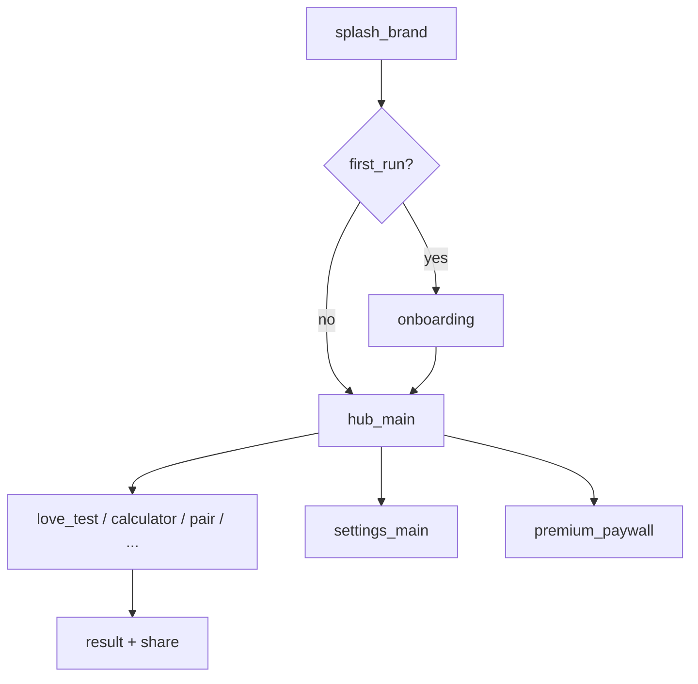

# PRD: Love Tester (Тест на совместимость и любовь)

Версия документа: **0.1** (фаза 0). Инвентарь UI после F1: `SCREEN_INVENTORY_AND_NAVIGATION.md`, `screens_catalog.csv`.

## 1. Позиционирование

**Love Tester** — лёгкое Android-приложение с **развлекательными** тестами «совместимости» и «любви»: ввод имён (и других данных), анимация «расчёта», процент и текст результата, шаринг карточки. Позиционирование как **игра/развлечение**, не научный или медицинский инструмент.

**Отличие от оригинала (Unity 3.0.5):** новый стек (Kotlin + Jetpack Compose + Material 3), новые тексты и визуал, локальный алгоритм в MVP без Unity. Референс — только для сценариев и охвата фич (см. `REFERENCE_SOURCES.md`).

**Честное ограничение:** проценты и формулировки **не отражают** реальную совместимость; в приложении и Store — явный disclaimer (см. `ONBOARDING_AND_LEGAL.md`).

## 2. Целевая аудитория

- Пары и друзья, которые хотят «проверить» имена в шутку.
- Пользователи 13+ (рейтинг Store — «для всех» / по анкете IARC без азарта).
- Рынки: RU и EN в MVP (строки `values` / `values-en`).

## 3. User stories

### Главный тест (MVP)

- **US-01:** Как пользователь, хочу ввести своё имя и имя партнёра и нажать «Рассчитать», чтобы увидеть процент «любви».
- **US-02:** Как пользователь, хочу видеть короткую анимацию расчёта, чтобы ощущать «магию» теста.
- **US-03:** Как пользователь, хочу получить разный тон текста при низком и высоком проценте, чтобы результат был выразительным.
- **US-04:** Как пользователь, хочу поделиться результатом (Share intent + карточка), чтобы отправить в мессенджер.

### Hub и навигация (MVP)

- **US-10:** Как пользователь, хочу с главного экрана выбрать тип теста (карточки), чтобы перейти к нужному сценарию.
- **US-11:** Как пользователь при первом запуске, хочу краткий онбординг (3 слайда) с disclaimer, чтобы понимать развлекательный характер; возможность пропустить.

### Монетизация (MVP — каркас)

- **US-20:** Как пользователь, хочу купить Premium (без рекламы) через Play Billing, если продукт настроен при сборке.
- **US-21:** Как пользователь без Premium, хочу видеть рекламу между сессиями (после F5; в MVP — заглушки/флаги без тяжёлых SDK до согласования политики).

### Дополнительные тесты (v2 или поздний MVP)

- **US-30:** Калькулятор любви по именам (отдельный flow).
- **US-31:** Совместимость пары по именам.
- **US-32:** «Победа в любви» по совместимости имён.
- **US-33:** Тест по буквам.
- **US-34:** Астрология — выбор знаков зодиака → результат.
- **US-35:** Колесо фантазий (random + анимация).
- **US-36:** Протокольный тест (упомянут в Store оригинала — уточнить по скриншотам `reference/screenshots/`).

### Настройки

- **US-40:** Как пользователь, хочу открыть настройки (язык системы / политика / повтор онбординга / Premium).
- **US-41:** Как пользователь, хочу открыть политику конфиденциальности в браузере (URL из `BuildConfig`).

## 4. Алгоритм совместимости (MVP)

- **Локально на устройстве**, без обязательного backend.
- Детерминированная или псевдослучайная функция от нормализованных имён (и параметров теста): стабильный результат для одной пары ввода в рамках версии приложения.
- **Не** копировать бинарную логику Unity; новая формула + пул шаблонов текстов (RU/EN).
- Документировать в коде: «entertainment only».

## 5. Экраны (сводка до F1)

Черновик `screen_id`: `docs/product/screens_catalog_DRAFT.md` (~26 состояний). После F1 — `screens_catalog.csv` и навигационная матрица.

Стартовый граф (логический):

## 6. Нефункциональные требования

| Область | Требование |
|---------|------------|
| **Платформа** | `minSdk` 26, `targetSdk` 35, Jetpack Compose, Material 3 light. |
| **Офлайн** | Все расчёты и UI работают без сети; сеть — только реклама, billing, Firebase (если включены). |
| **Приватность** | Имена не отправляются на сервер в MVP; при добавлении аналитики — обновить Data safety. |
| **Локализация** | RU + EN; парность ключей — `verifyUiInventory`. |
| **Доступность** | `contentDescription` на CTA и процентах; `liveRegion` для ошибок. |
| **Проверки** | `./gradlew verifyLoveTest` (после F3). |
| **Размер** | Цель: существенно меньше 64 МБ Unity-бандла; без тяжёлых game assets. |

## 7. MVP vs v2

### MVP (релиз 1.0)

| Включено | Исключено / заглушка |
|----------|---------------------|
| Hub с карточками основных тестов | Полный набор 10 режимов, если не успеваем — hub показывает «скоро» |
| Love test: input → calculating → result (+ low variant) | Protocol test до уточнения UX |
| Share результата | Сложная кастомная карточка — простой bitmap/share text |
| Onboarding 3 слайда + disclaimer | Lottie (только вектор/Compose) |
| Settings, Privacy link | Полная локализация >2 языков |
| Premium paywall UI + Billing hook | Полная медиация ads (можно flag + test ids) |
| UMP/consent экран (если ads в релизе) | Firebase push, если не нужен |

### v2

- Все тесты из Store-листа (калькулятор, пара, победа, буквы, зодиак, колесо).
- Межстраничная реклама, rewarded (если в продукте).
- История последних результатов (локально).
- Виджет / shortcuts (опционально).
- A/B текстов результатов.

## 8. Риски

| Риск | Митигация |
|------|-----------|
| Store policy «misleading claims» | Disclaimer везде; не обещать «правду о любви». |
| Trademark «Love Tester» | Своё название листинга; юридическая проверка перед публикацией. |
| Ads SDK раздувают APK | Один mediation stack; отложить до post-MVP при необходимости. |
| Нет скриншотов референса | `reference/screenshots/` — блокер для точного F2; использовать DRAFT + description.rtf. |
| Billing без тестовых SKU | Closed testing + license testers в Console. |

## 9. Out of scope

- Серверная «настоящая» астрология или ML-модель отношений.
- Социальная сеть, чаты, знакомства.
- iOS/web в этом репозитории.
- Порт Unity сцен и ассетов.

## 10. Продуктовые решения (требуют утверждения)

См. [PRODUCT_DECISIONS.md](./PRODUCT_DECISIONS.md) — бренд, монетизация, локали, MVP scope.  
Общий pipeline трёх новых проектов: [CROSS_PROJECT_PIPELINE.md](./CROSS_PROJECT_PIPELINE.md).

## 11. Связанные документы

- [DEVELOPMENT_PLAN.md](./DEVELOPMENT_PLAN.md) — объёмный план разработки.
- [SCREENS_MASTER_PLAN.md](./SCREENS_MASTER_PLAN.md) — экраны **№1–30**.
- `WORK_PLAN.md` — статус фаз.
- `STACK.md` — технологии.
- `ONBOARDING_AND_LEGAL.md` — согласия и тексты.
- `GOOGLE_PLAY_RELEASE_CHECKLIST.md` — выкладка.
- `REFERENCE_SOURCES.md` — референс 3.0.5.
