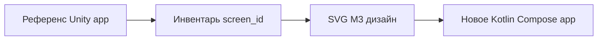

# Источники референса (Love Test 3.0.5)

## 1. Описание продукта

**Файл:** `info/description.rtf`  
**Пакет оригинала:** `com.LoveMaker.TrueLoveTest`  
**Версия:** 3.0.5  

### Функции из Store (кратко)

| # | Фича | Заметка для нового UI |
|---|------|------------------------|
| 1 | Тест на любовь (имена → %) | Основной flow |
| 2 | Калькулятор любви по именам | Отдельный экран |
| 3 | «Победа в любви» по совместимости имён | Отдельный тест |
| 4 | Совместимость пары по именам | Два поля имени |
| 5 | Колесо фантазий любви | Анимация / random |
| 6 | Поделиться результатами | Share intent + карточка |
| 7 | Premium / без рекламы | Paywall, IAP |
| 8 | Тест любви по буквам | Отдельный ввод |
| 9 | Астрология / знаки зодиака | Выбор знаков → результат |
| 10 | Протокольный тест любви | Упомянут в тексте Store |

Монетизация оригинала (по манифесту): **реклама** (AppLovin, Unity Ads, др.), **Play Billing**, Firebase.

---

## 2. Декомпилированный APK

**Путь:** `Love Test - Compatibility Test_3.0.5_apkcombo.com.xapk_Decompiler.com/`

| Что смотреть | Что не смотреть |
|--------------|-----------------|
| `resources/.../AndroidManifest.xml` — permissions, activities SDK | `sources/*.java` obfuscated — не UI |
| `resources/com.LoveMaker.TrueLoveTest.apk/assets/` — Unity data | Не портировать Unity сцены |
| `res/values/strings.xml` — в основном системные строки SDK | |

Строки игры чаще в **Unity assets** (бинарные). Для копирайта опирайся на `description.rtf` + скриншоты.

---

## 3. Скриншоты (добавить вручную)

Рекомендуемая структура:

```
reference/
  screenshots/
    play/          # витрина Play, если есть
    device/        # проход по всем тестам с устройства
    INDEX.md       # список файлов → будущий screen_id
```

При добавлении заполни `INDEX.md` в формате:

```markdown
| файл | предполагаемый screen_id | заметки |
|------|--------------------------|---------|
| 01_hub.png | hub_main | главное меню |
```

---

## 4. Стратегия пересборки



- **Не** «починить декомпил»  
- **Да** «новое приложение с тем же продуктом»

Дизайн: романтическая M3-палитра (не копия фиолетового LockDraw).  
Предложение primary: `#C2185B` / `#E91E63`, surface `#FFFBFE`, акценты сердца/проценты.

---

## 5. Юридическое

Референс — только для понимания UX. Тексты, иллюстрации, алгоритмы и бренд — **новые**. Не копировать trademark «Love Tester» без проверки юристом/Store policy.

---

## 6. Маппинг фич Store → инвентарь (F1)

Связь с [screens_catalog.csv](./screens_catalog.csv) (**29** `screen_id`). Новое приложение: `dev.lovetest.app`.

| # | Фича (§1) | screen_id (новое приложение) | Статус |
|---|-----------|------------------------------|--------|
| 1 | Тест на любовь | `love_test_input`, `love_test_calculating`, `love_test_result`, `love_test_result_low` | В каталоге |
| 2 | Калькулятор любви | `calculator_input`, `calculator_result` | В каталоге |
| 3 | Победа в любви | `victory_input`, `victory_result` | В каталоге |
| 4 | Совместимость пары | `pair_input`, `pair_result` | В каталоге |
| 5 | Колесо фантазий | `wheel_spin`, `wheel_result` | В каталоге |
| 6 | Поделиться | `share_result_card` + Share на result-экранах | В каталоге |
| 7 | Premium | `premium_paywall`, `premium_thank_you` | В каталоге |
| 8 | Тест по буквам | `letters_input`, `letters_result` | В каталоге |
| 9 | Зодиак | `zodiac_pick`, `zodiac_result` | В каталоге |
| 10 | Протокольный тест | — | **Нет в `description.rtf` и скриншотах** — добавить `screen_id` после `reference/screenshots/` |

Системные экраны: `splash_brand`, `onboarding_*`, `consent_ads_gdpr`, `hub_main`, `settings_main`, `hub_loading`, `error_network`, `ad_interstitial_placeholder`.

**Скриншоты референса:** [reference/screenshots/INDEX.md](../../reference/screenshots/INDEX.md) — пока пусто; без `device/*.png` F2 уточняет hub по CSV + Store-тексту.
