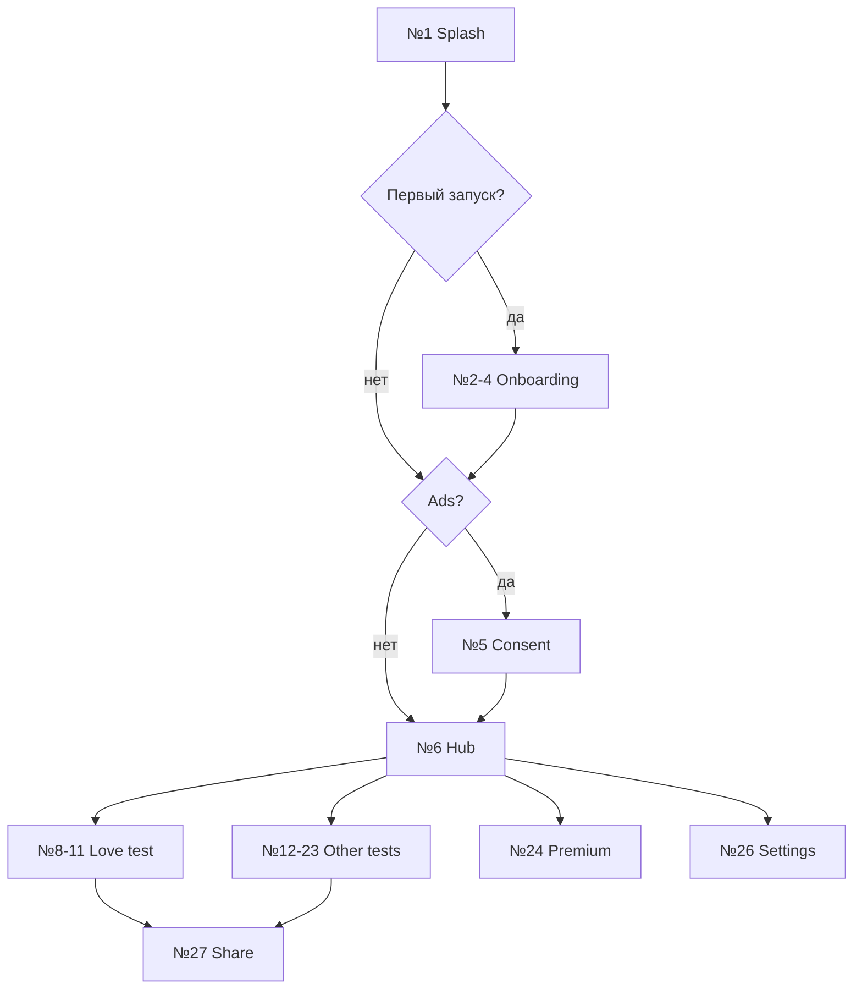

# План всех экранов — Love Tester

**Пакет:** `dev.lovetest.app` · **Каталог UI:** **34** screen_id (`screens_catalog.csv`).

Нумерация **№1–№34** — для дизайна (SVG), Store-скриншотов (RU/EN), QA.

**Источник правды:** [screens_catalog.csv](./screens_catalog.csv).

---

## Сводная таблица (все экраны)

| № | screen_id | Название (RU) | Группа | route_path | MVP | SVG |
|---|-----------|---------------|--------|------------|-----|-----|
| **1** | `splash_brand` | Заставка / бренд | Система | `splash` | ✅ | `screen1_…` |
| **2** | `onboarding_welcome` | Онбординг — приветствие | Онбординг | `onboarding` (стр. 1) | ✅ | `screen2_…` |
| **3** | `onboarding_tests` | Онбординг — виды тестов | Онбординг | `onboarding` (стр. 2) | ✅ | `screen3_…` |
| **4** | `onboarding_disclaimer` | Онбординг — только развлечение | Онбординг | `onboarding` (стр. 4) | ✅ | `screen4_…` / `screen36_…` |
| **5** | `consent_ads_gdpr` | Согласие рекламы (UMP) | Система | `consent` | ⚙️¹ | `screen5_…` |
| **6** | `hub_main` | Главное меню (хаб тестов) | Hub | `hub` | ✅ | `screen6_…` |
| **7** | `hub_loading` | Хаб — загрузка | Hub | `hub` | ✅ | `screen7_…` |
| **8** | `love_test_input` | Тест на любовь — ввод имён | Тест №1 | `love_test/input` | ✅ | `screen8_…` |
| **9** | `love_test_calculating` | Тест на любовь — расчёт | Тест №1 | `love_test/calculating` | ✅ | `screen9_…` |
| **10** | `love_test_result` | Тест на любовь — результат (высокий %) | Тест №1 | `love_test/result` | ✅ | `screen10_…` |
| **11** | `love_test_result_low` | Тест на любовь — результат (низкий %) | Тест №1 | `love_test/result` | ✅ | `screen11_…` |
| **12** | `calculator_input` | Калькулятор любви — ввод | Тест №2 | `calculator/input` | 📦² | `screen12_…` |
| **13** | `calculator_result` | Калькулятор любви — результат | Тест №2 | `calculator/result` | 📦² | `screen13_…` |
| **14** | `pair_input` | Совместимость пары — ввод | Тест №3 | `pair/input` | 📦² | `screen14_…` |
| **15** | `pair_result` | Совместимость пары — результат | Тест №3 | `pair/result` | 📦² | `screen15_…` |
| **16** | `victory_input` | Победа в любви — ввод | Тест №4 | `victory/input` | 📦² | `screen16_…` |
| **17** | `victory_result` | Победа в любви — результат | Тест №4 | `victory/result` | 📦² | `screen17_…` |
| **18** | `letters_input` | Тест по буквам — ввод | Тест №5 | `letters/input` | 📦² | `screen18_…` |
| **19** | `letters_result` | Тест по буквам — результат | Тест №5 | `letters/result` | 📦² | `screen19_…` |
| **20** | `zodiac_pick` | Зодиак — выбор знаков | Тест №6 | `zodiac/pick` | 📦² | `screen20_…` |
| **21** | `zodiac_result` | Зодиак — результат | Тест №6 | `zodiac/result` | 📦² | `screen21_…` |
| **22** | `wheel_spin` | Колесо фантазий — крутить | Тест №7 | `wheel/spin` | 📦² | `screen22_…` |
| **23** | `wheel_result` | Колесо фантазий — результат | Тест №7 | `wheel/result` | 📦² | `screen23_…` |
| **24** | `premium_paywall` | Premium — покупка | Монетизация | `premium/paywall` | ✅ | `screen24_…` |
| **25** | `premium_thank_you` | Premium — спасибо за покупку | Монетизация | `premium/thank_you` | ✅ | `screen25_…` |
| **26** | `settings_main` | Настройки | Система | `settings` | ✅ | `screen26_…` |
| **27** | `share_result_card` | Превью карточки «Поделиться» | Шаринг | — (overlay) | ✅ | `screen27_…` |
| **28** | `error_network` | Ошибка сети (баннер/экран) | Состояния | `hub` | ⚙️¹ | `screen28_…` |
| **29** | `ad_interstitial_placeholder` | Межстраничная реклама (макет) | Монетизация | — (SDK) | ⚙️¹ | `screen29_…` |
| **30** | `onboarding_protocol` | Онбординг — протокол любви | Онбординг | `onboarding` (стр. 3) | ✅ | `screen35_…` |
| **31** | `protocol_input` | Протокол — ввод | Тест №8 | `protocol/input` | ✅ | `screen30_…` |
| **32** | `protocol_calculating` | Протокол — расчёт | Тест №8 | `protocol/calculating` | ✅ | `screen32_…` |
| **33** | `protocol_result` | Протокол — результат (высокий %) | Тест №8 | `protocol/result` | ✅ | `screen31_…` |
| **34** | `protocol_result_low` | Протокол — результат (низкий %) | Тест №8 | `protocol/result` | ✅ | `screen34_…` |

---

## Группы экранов (логическая структура)

### A. Система и первый запуск (№1–№7, №26, №28–№29)

| № | Экран | Назначение | Ключевые элементы |
|---|--------|------------|-------------------|
| 1 | Заставка | Бренд, короткая загрузка | Логотип, индикатор |
| 2–4 | Онбординг | Ожидания + disclaimer + протокол | Pager **4** стр., «Пропустить» |
| 5 | Consent | UMP / GDPR перед рекламой | Принять / настроить |
| 6 | Хаб | Выбор теста | Сетка карточек, Premium, Settings |
| 7 | Хаб loading | Инициализация SDK | Progress, не блокирует навсегда |
| 26 | Настройки | Политика, онбординг, Premium | Ссылки, версия |
| 28 | Нет сети | Ошибка конфига/ads | Retry |
| 29 | Interstitial | Документация UX рекламы | Placeholder для Store/QA |

### B. Основной тест — «Тест на любовь» (№8–№11) — **ядро MVP**

| № | Экран | Переход |
|---|--------|---------|
| 8 | Ввод | Два поля имён, CTA «Рассчитать» |
| 9 | Расчёт | 1.5–3 с анимация, сердца |
| 10 | Результат high | % ≥ порога (напр. 50%), share |
| 11 | Результат low | % < порога, другой копирайт |

### C. Дополнительные тесты (№12–№23, №30)

Каждый тест = **ввод (нечётный №)** + **результат (чётный №)**.

| Тест | № ввод | № результат | Референс Store |
|------|--------|-------------|----------------|
| Калькулятор любви | 12 | 13 | Фича #2 |
| Совместимость пары | 14 | 15 | Фича #4 |
| Победа в любви | 16 | 17 | Фича #3 |
| По буквам | 18 | 19 | Фича #8 |
| Зодиак | 20 | 21 | Фича #9 |
| Колесо фантазий | 22 | 23 | Фича #5 |
| Протокольный | 30 (план) | 30b (план) | Фича #10 |

### D. Монетизация и шаринг (№24–№25, №27)

| № | Экран | Назначение |
|---|--------|------------|
| 24 | Paywall | Список преимуществ, купить, restore |
| 25 | Thank you | Подтверждение покупки |
| 27 | Share card | Превью bitmap/текста перед системным Share |

---

## Карта навигации (упрощённо)

---

## Store-скриншоты (план)

На каждый **№1–№29** (кроме №29 при отключённой рекламе):

- `docs/screenshots/ru/<screen_id>.png`
- `docs/screenshots/en/<screen_id>.png`

**Итого файлов:** до **58 PNG** (29 × 2 локали). №30 — +2 PNG после появления экрана.

---

## Очередь реализации UI (фаза F4)

Рекомендуемый порядок по номерам:

| Этап | Экраны № | Спринт |
|------|----------|--------|
| 1 | 1, 6 | Заставка + хаб |
| 2 | 2, 3, 4 | Онбординг |
| 3 | 8, 9, 10, 11 | Love test (MVP) |
| 4 | 26, 24, 25 | Settings + Premium |
| 5 | 27 | Share |
| 6 | 12–23 | Остальные тесты |
| 7 | 5, 7, 28, 29 | Consent, loading, errors, ads |
| 8 | 30 | Протокольный (после референса) |

---

## Связанные файлы

- [DEVELOPMENT_PLAN.md](./DEVELOPMENT_PLAN.md) — объёмный план разработки по фазам
- [screens_catalog.csv](./screens_catalog.csv) — машиночитаемый каталог №1–№29
- [nav_matrix.csv](./nav_matrix.csv) — переходы между экранами
- [REFERENCE_SOURCES.md](./REFERENCE_SOURCES.md) — фичи оригинала 3.0.5
