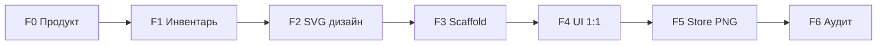

# План работ: Love Tester

Метод: LockDraw (`CURSOR_LOVE_TEST_PLAYBOOK.md`). Текущий статус: **F0–F6 (код) завершены** · Store PNG и Console — локально на машине разработчика.

**Главные планы:** [DEVELOPMENT_PLAN.md](./DEVELOPMENT_PLAN.md) · [SCREENS_MASTER_PLAN.md](./SCREENS_MASTER_PLAN.md) (№1–№34).

## Обзор фаз

---

## F0 — Продукт и структура ✅

**Сделано:**

- [x] `PRD.md`, `STACK.md`, `RELEASE_ENGINEERING.md`, `ONBOARDING_AND_LEGAL.md`
- [x] `GOOGLE_PLAY_RELEASE_CHECKLIST.md`, `CURSOR_LOVE_TEST_PLAYBOOK.md`
- [x] `reference/screenshots/{play,device}/`, `INDEX.md`
- [x] Черновик screen_id: `screens_catalog_DRAFT.md`

**Не делалось (намеренно):** Kotlin, Gradle, SVG.

---

## F1 — Инвентарь экранов и навигация ✅

**Сделано:**

- [x] `SCREEN_INVENTORY_AND_NAVIGATION.md` — 20 route_path, 29 screen_id
- [x] `screens_catalog.csv`, `nav_matrix.csv`
- [x] `SCREEN_INVENTORY_INDEX.md`
- [x] `scripts/verify_ui_inventory.py` (`--inventory-only` → OK)
- [x] `docs/design/README.md` — таблица 29 SVG (файлы в F2)

**Уточнить после скриншотов:** `reference/screenshots/device/` → hub-карточки, protocol test.

---

## F2 — Дизайн-система + SVG ✅

| Шаг | Deliverable |
|-----|-------------|
| 2A | `DESIGN_SYSTEM.md` ✅, `screen1_love_test_splash_brand_m3.svg` ✅ |
| 2B | Пакеты по 4–6 SVG (hub, love_test, premium, settings, states) |
| 2C | 100% строк `screens_catalog.csv` имеют `design_svg` |

Палитра: primary `#C2185B`, surface `#FFFBFE`, errorContainer `#F9DEDC`.

---

## F3 — Android scaffold ✅

| Шаг | Deliverable |
|-----|-------------|
| Модули | `:app`, `:core:ui`, `:core:domain` |
| Nav | `LoveTestNavHost`, заглушки Composable |
| Theme | `LoveTestTheme` из DESIGN_SYSTEM |
| Strings | RU/EN ключи из инвентаря |
| Gradle | `verifyLoveTest`, `verifyUiInventory`, placeholders |
| Debug | `DEBUG_START_ROUTE`, `DebugUiPreview` |

Критерий: `./gradlew verifyLoveTest` зелёный.

Скопировать из **NEWlockscreen**: build tasks, scripts (см. `RELEASE_ENGINEERING.md`).

---

## F4 — UI 1:1 по SVG ✅

Итерации **один screen_id** за чат; после каждой — `compileDebugKotlin` + `verifyLoveTest`.

**Рекомендуемая очередь:**

1. `splash_brand`, `hub_main`
2. `onboarding_*` (4 страницы: welcome, tests, protocol, disclaimer)
3. `love_test_input`, `love_test_calculating`, `love_test_result`, `love_test_result_low`
4. `settings_main`, `premium_paywall`, `premium_thank_you`
5. Остальные тесты из CSV
6. `consent_ads_gdpr`, `hub_loading`, `error_network`

Сохранить промпт: `docs/design/UI_IMPLEMENTATION_PROMPT.md`.

---

## F5 — Скриншоты Store (инфраструктура ✅ · съёмка ⏳)

- `docs/screenshots/ru|en/`, `CAPTURE_CHECKLIST.md`, `WORKFLOW.md`
- `adb_screenshot_preview.sh`, `captureScreenshotCatalogRu/En`
- Реальные 1080×1920 PNG; `verifyLoveTestBeforeStore`

---

## F6 — Аудит перед Play ✅

- CSV ↔ SVG ↔ Composable ↔ PNG
- Отчёт P0/P1/P2
- Минимальные фиксы только P0

---

## Риски и отложено в v2

| Отложено | Причина |
|----------|---------|
| Полная медиация ads (AppLovin/Unity) | SDK weight + UMP; MVP может ship с `ADS_ENABLED=false` |
| Firebase push | Не в core UX |
| Backend / аккаунты | PRD: локальный алгоритм |
| Deep links | Не MVP |
| История тестов | v2 feature |

---

## Следующий шаг (локально)

1. `./scripts/onboard_release.sh [USER REPO]` — конфиг + health + git hints
2. `./scripts/project_health.sh` — быстрая сводка
3. `./scripts/play_console_next.sh` — один шаг до Play
4. `./gradlew finalizeStoreReleaseLoveTest` — upload-пакет
5. Play Console — `docs/store/STORE_UPLOAD.md`, `BILLING_SETUP.md`
